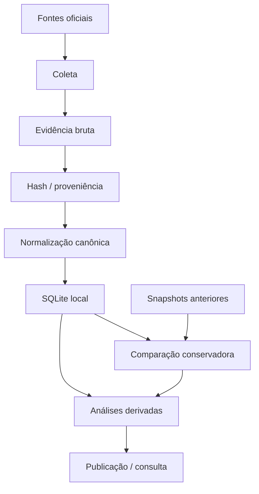

# Transparência Municipal

Framework aberto e replicável para **coletar, preservar e analisar dados públicos municipais** com rastreabilidade até a fonte original.

O projeto cobre receitas, despesas, agentes públicos, atividade legislativa, licitações e contratos sem tratar dados derivados como se fossem fatos primários.

> **Sem fonte, sem fato.** Toda afirmação publicada precisa manter um caminho verificável até a evidência que a sustenta.

## Em 30 segundos

O framework foi desenhado para responder perguntas como:

- quanto o município arrecadou e gastou;
- qual órgão realizou uma despesa;
- quem foi o favorecido;
- qual contrato/licitação está relacionado quando existe identidade oficial suficiente;
- como um dado mudou entre snapshots comparáveis;
- qual fonte sustenta cada afirmação.

A primeira implantação é **Salvador/BA**, mantida na branch `city/salvador`.

## Arquitetura



## Estrutura por branch

- `main` — engine genérica, sem integração de município específico;
- `city/<slug>` — configuração, fontes, evidências, coletores e camada de publicação de uma cidade.

Isso permite evoluir o núcleo sem misturar regras locais de portais diferentes.

## Garantias do núcleo

| Garantia | Regra |
|---|---|
| proveniência | evidência bruta e origem são preservadas |
| completude | é declarada por fonte e filtro; nunca universal por conveniência |
| identidade | relações entre sistemas exigem identificadores oficiais compatíveis |
| contabilidade | empenho, liquidação e pagamento permanecem estágios distintos |
| privacidade | CPF não é promovido para diretório empresarial público |
| histórico | diferenças são calculadas somente entre snapshots comparáveis |
| precisão | dado derivado não pode ganhar precisão que a fonte não oferece |

O contrato completo de adaptadores municipais está em [`docs/city-adapter.md`](docs/city-adapter.md).

## Modelo de evidência

A intenção do projeto é que um resultado não seja apenas um número, mas um número acompanhado de contexto suficiente para auditoria:

```text
fato publicado
  ↓
registro normalizado
  ↓
identidade oficial / chave da fonte
  ↓
snapshot consultado
  ↓
endpoint / documento de origem
```

Hashes SHA-256 podem ser usados para preservar a identidade do artefato bruto coletado.

## Objetivos

- responder quanto um município arrecada e gasta;
- ligar despesas a órgão, favorecido, contrato e licitação quando a fonte permite;
- acompanhar o Legislativo sem confundir gasto institucional com gasto individual;
- reconciliar fontes complementares somente com identificadores oficiais adequados;
- preservar evidência bruta e SHA-256;
- tornar afirmações reproduzíveis e citáveis;
- comparar snapshots sem inventar continuidade documental.

## Criando uma nova cidade

```bash
cp -R cities/_template cities/minha-cidade
# edite city.json e sources.csv
python -m transparencia --city minha-cidade sources
```

Para uma implantação oficial, crie uma branch `city/minha-cidade` a partir de `main`.

O adaptador traduz campos específicos da fonte para o esquema canônico do core; detalhes de endpoint, paginação e peculiaridades locais ficam fora da engine genérica.

## PNCP

```bash
python -m transparencia --city minha-cidade collect-pncp \
  --start 2026-01-01 --end 2026-01-31 --scope executivo
```

O coletor usa UF e código IBGE da cidade, descobre modalidades ativas no domínio oficial do PNCP e preserva os snapshots consultados.

O PNCP continua sendo uma fonte independente: a completude de uma consulta PNCP não torna automaticamente completa uma fonte municipal.

## Banco local

```bash
python -m transparencia --city minha-cidade build-db
```

O SQLite gerado contém `city_slug` nas tabelas factuais para impedir mistura silenciosa entre municípios.

## Regras de ligação

O framework evita fuzzy matching como se fosse prova de identidade.

Exemplos de sinais que **não bastam sozinhos** para declarar que dois registros são o mesmo objeto:

- nomes parecidos;
- descrições semelhantes;
- mesmo fornecedor por texto livre;
- mesmo valor aproximado.

Quando uma ligação é publicada como factual, ela deve depender de chaves oficiais compatíveis ou de regra documental explicitamente auditável.

## Histórico e snapshots

Comparação temporal só deve ocorrer quando os snapshots forem:

- completos para o mesmo filtro declarado;
- provenientes da mesma família de fonte;
- comparáveis em identidade e semântica;
- preservados com metadados suficientes para reprodução.

A ausência de um registro em uma coleta incompleta não é tratada automaticamente como remoção real.

## Regra editorial

**Sem fonte, sem fato.**

Dados calculados, reconciliados ou inferidos devem continuar ligados às entradas que os originaram e não podem aumentar artificialmente a precisão do documento publicado.

## Escopo e limites

Este projeto não assume que portais públicos são completos, estáveis ou semanticamente uniformes.

O framework busca tornar essas limitações **visíveis**, em vez de escondê-las atrás de uma interface aparentemente precisa.
